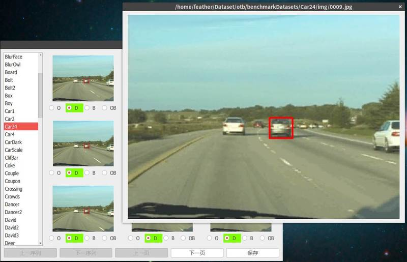

# ODBAnnotator
Occlusion, deformation, blur annotator for tracking decision making.

## Requirement
- python2
- pyqt4

## Usage
1. Prepare raw data first: 
    - link OTB datasets directory to ./data/imageFiles
        ln -s $YOUR_OTB_PATH ./data/imageFiles
    - link annotated mat file directory to ./data/annotateFiles
        ln -s $YOUR_MAT_PATH ./data/annotateFiles

2. Some keyboard shortcut can be used:
    - Up+Enter: select previous sequence
    - Down+Enter: select next sequence
    - Left: show previous page of current sequence
    - Right: show next page of current sequence
    - Esc: save and quit
    - Backspace: toggle full-screen
    
3. Hint: click some image can make it display on a big window.

## Screenshot

